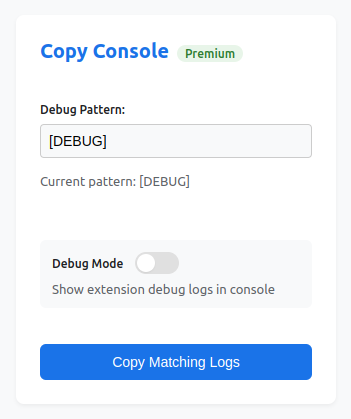

# Copy Console Browser Extension 🚀

> Supercharge your debugging workflow by instantly capturing and copying console logs with pattern matching!

  
  
  

    
    
  

## ✨ Features

- 🎯 **Smart Pattern Matching**: Easily copy console logs containing your specified patterns (default: `[DEBUG]`)
- ⚡ **Lightning Fast**: Efficient console message interception with zero performance impact
- 🎨 **Visual Feedback**: Clean notifications when logs are copied
- 🛠️ **Highly Configurable**: Customize patterns to match your logging style
- 🔄 **Universal Console Support**: Works with all console methods (log, info, warn, error)
- 📦 **Lightweight**: Minimal dependencies, built for performance
- 🌐 **Cross-Browser**: Fully supported on Chrome and Firefox

## 🚀 Quick Start

1. Install the extension:
   - [Chrome Web Store](https://chrome.google.com/webstore/category/extensions)
   - [Firefox Add-ons](https://addons.mozilla.org/en-US/firefox/extensions/)

2. After installation, you'll see the extension icon in your browser toolbar

## 🎮 Usage

1. Click the extension icon in your toolbar to copy matching logs
2. Configure pattern matching in the options page (right-click icon → Options)
3. Watch as your matching logs are collected automatically
4. One-click copy to clipboard when you need them!

---

  <strong>Made with ❤️ for developers who love build fast</strong>

 